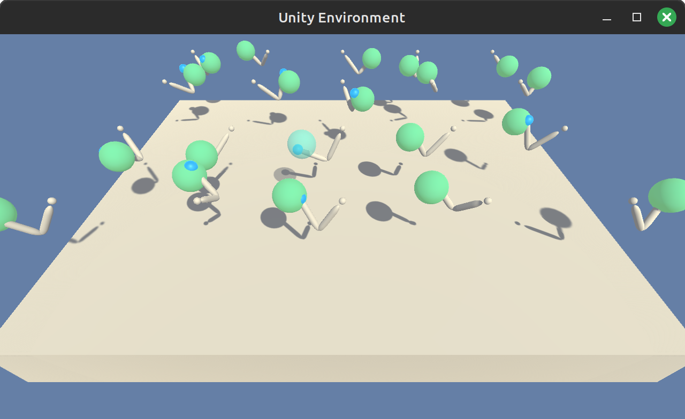

# Reacher World!

Continuous-control project for the Udacity deep reinforcement learning nano-degree.

<div>
  
</div>

## Getting Started

The instructions below are intended only for Linux environments.

### Python Virtual Environment

[Install Anaconda](https://docs.anaconda.com/free/anaconda/install/linux/), create a new Python
`3.6` virtual environment, and activate it:

```bash
$> conda create --name drlnd python=3.6
$> conda activate drlnd
```

### Install Dependencies

Enter the `python` folder, and install the dependencies:

```bash
(drlnd) $> cd python
(drlnd) $> pip install .
```

Note that Udacity provides a custom setup of Unity ML-Agents. Some dependencies have been updated
updated from the Udacity repository because obsolete, notably PyTorch is at version `1.10.0`.

### Download the Unity Environment

Download and unzip the `Reacher` Unity environment in the `unity_env` folder (both the with and
without visualization). Follow the instructions in the `unity_env/README.md` file to do that.

### Additional Notes

The configuration used to run this code is Dell XPS-13-9310 with Linux Mint 21.2. MESA rendering
issues with Anaconda have been encountered (see [here](https://askubuntu.com/a/1405450), and
[here](https://stackoverflow.com/questions/71263856/kivy-not-working-mesa-loader-failed-to-open-iris-and-swrast)).
If the aforementioned instructions don't work, it is likely a custom environment issue that needs
to be troubleshooted ad-hoc.

## Instructions

To watch the pretrained PPO agent, run:

```bash
(drlnd) $> python reacher.py --simulation
```

You'll see first the scores plot, and then the Unity simulation once the plot window is closed.
The weights and scores of the pretrained agent are in the `weithts_pretrained.pth` and the
`scores_pretrained.csv` files respectively.

To train a new agent instead, run:

```bash
(drlnd) $> python reacher.py --train
```

Two new files `scores.csv` and `weights.pth` are created. Add a `_<NAME>` suffix to run your
simulation via:

```bash
(drlnd) $> python reacher.py --simulation=<NAME>
```

## Environment Details

The environment consists of 20 double-jointed arms can move to target locations. In the code, we
refer to each arm/agent as a "bot", to disambiguate with the actual trained agent.

The observation space consists of `33` variables corresponding to position, rotation, velocity, and
angular velocities of the arm. Each action is a vector with four numbers, corresponding to torque
applicable to two joints. Every entry in the action vector must be a number between `-1`and `1`.

For each step that the agent's hand is in the goal location, a reward is provided. From tinkering
with the environment, the reward is never bigger than `+0.4`. Moreover, the environment seems to
have episodes of fixed length of `1001` steps (and all bots always complete at once).

We exploit the aforementioned environment behaviors to have even training loops (see implementation
details in the report).

This differs from the original Udacity environment description, which probably needs an update.
See: https://knowledge.udacity.com/questions/558456

### When Is The Environment Solved?

The environment is considered solved when the agent is able to receive an average reward (over 100
episodes, and over all 20 agents) of at least `+30`.

## Resources

In order to implement the PPO algorithm, I used various resources:

 * Udacity nano-degree lectures, first and foremost
 * Hugging Face [Deep RL course](https://huggingface.co/learn/deep-rl-course)
 * Original [PPO paper](https://arxiv.org/abs/1707.06347)
 * CleanRL [implementation](https://github.com/vwxyzjn/cleanrl) and its very well-written analysis
   that can be [found here](https://iclr-blog-track.github.io/2022/03/25/ppo-implementation-details/).
   This project implementation differs from the CleanRL one in various aspects though (e.g., PPO loss,
   training loop, code structure, etc.)
